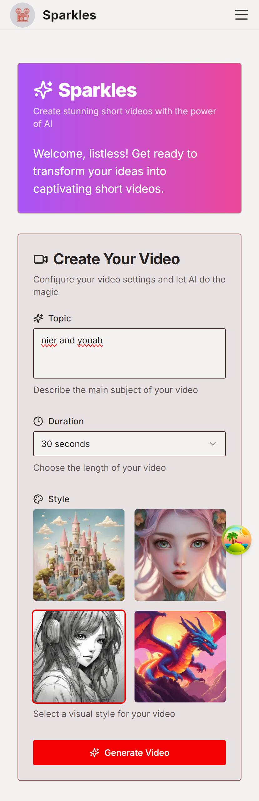
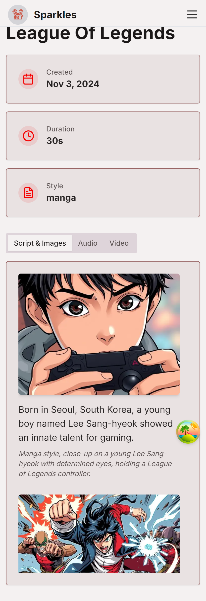
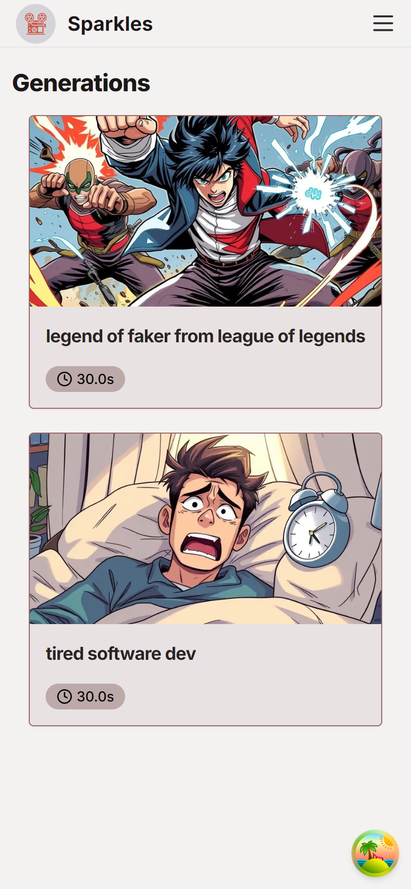
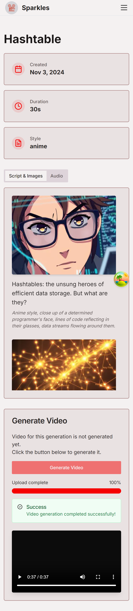
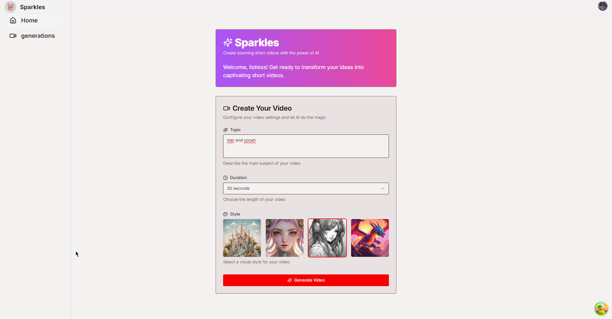
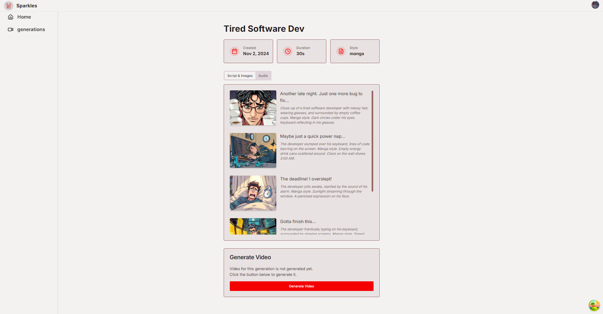

# Sparkles

Sparkles is a web application that allows users to create short-form videos using AI.

## Getting Started

### Prerequisites

- Node.js
- Bun
- Docker and Docker Compose (for deployment)

### Installation

1. Clone the repository:

   ```
   git clone git@github.com:listlessbird/brainrot-shorts.git
   cd brainrot-shorts
   ```

2. Install dependencies for the web interface:

   ```
   cd web
   bun install
   ```

3. Run migrations

   ```
   bun db:gen
   bun db:mig
   ```

   Make sure you have setup all the environment variables

4. Install dependencies for the renderer:

   ```
   cd ../renderer
   bun install
   ```

5. Set up environment variables:
   - Copy `.env.example` to `.env` in the `web` directory and fill in the required values.

### Development

1. Start the web interface:

   ```
   cd web
   bun dev
   ```

2. Start the renderer service:

   ```
   cd renderer
   bun dev
   ```

3. Open [http://localhost:3000](http://localhost:3000) in your browser to access the application.

## Features

- Generate short-form video scripts based on user input
- Create AI-generated images for each scene
- Generate speech audio from the script
- Render final video with synchronized audio and images
- View and manage generated videos
- Directly upload to youtube from the app itself

## Deployment

The project includes Docker configurations for deployment:

1. Ensure all secrets are properly set up in `web/.env`.
2. Run the deployment script:
   ```
   ./run-compose.sh
   ```

This will build and start the necessary Docker containers for the web interface and renderer service.

## Project Structure

- `web/`: Next.js web application
- `renderer/`: remotion renderer service using Bun
- `docker-compose.yml`: Docker Compose configuration for deployment
- `run-compose.sh`: Deployment script

## Technologies Used

- Next.js
- React
- TypeScript
- Tailwind CSS
- Bun
- Remotion
- Docker

## Screenshots








## Contributing

Contributions are always welcome.

## License

This project is licensed under the MIT License.
